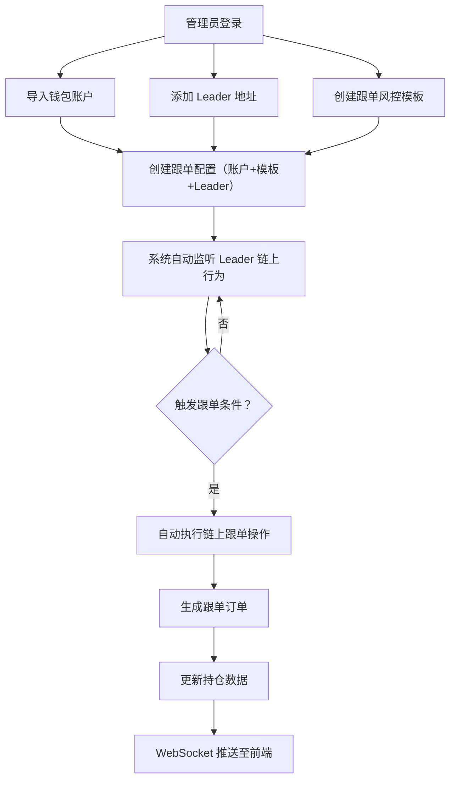

## 1. 产品概述

TAO Bittensor 链上跟单系统，帮助用户自动化跟随链上大户（Leader）的质押、交易操作，实现一站式多账户跟单管理与风控。

- 目标用户：TAO 公链投资者、算力质押矿工、多账户资产管理用户
- 核心价值：自动复刻 Leader 链上行为，降低人工盯盘成本，多层风控兜底保障资产安全

## 2. 核心功能

### 2.1 用户角色

| 角色 | 注册方式 | 核心权限 |
|------|----------|----------|
| 系统管理员 | 后台创建 | 全部功能权限，包括系统管理、用户管理、代理配置 |

### 2.2 功能模块

1. **登录/仪表盘**：管理员登录、系统概览数据仪表盘
2. **账户管理**：多 Substrate 钱包账户导入、查看、编辑、启停
3. **Leader 管理**：添加/查看链上大户地址、分类筛选、备注管理
4. **跟单模板**：创建风控跟单模板，配置比例/固定金额跟单参数
5. **跟单配置**：绑定账户+模板+Leader，一键创建跟单关系
6. **订单管理**：买入/卖出/跟单匹配订单查看与筛选
7. **仓位管理**：实时持仓可视化、WebSocket 推送、批量操作
8. **统计分析**：全局/LEDGER/跟单关系多维度统计报表
9. **系统管理**：代理配置、节点检测、用户管理、公告管理

### 2.3 页面详情

| 页面名称 | 模块名称 | 功能描述 |
|----------|----------|----------|
| 登录页 | 登录表单 | 管理员账号密码登录 |
| 仪表盘 | 概览统计 | 显示全系统资产总额、跟单账户数、活跃跟单数、盈亏概览 |
| 仪表盘 | 最近订单 | 最近10条跟单订单列表 |
| 仪表盘 | 系统状态 | 节点连接状态、代理运行状态 |
| 账户管理 | 账户列表 | 表格展示所有钱包账户，支持搜索、筛选、启停 |
| 账户管理 | 账户详情 | 查看账户余额、质押持仓、链上交易记录 |
| 账户管理 | 导入账户 | 通过私钥导入新账户 |
| Leader 管理 | Leader 列表 | 展示被跟单地址，支持分类筛选、备注编辑 |
| Leader 管理 | Leader 详情 | 查看 Leader 链上操作历史、收益统计 |
| 跟单模板 | 模板列表 | 展示所有风控模板，支持 CRUD |
| 跟单模板 | 创建/编辑模板 | 配置跟单方式、风控参数、滑点容忍度等 |
| 跟单配置 | 配置列表 | 展示所有跟单关系，支持启停 |
| 跟单配置 | 创建跟单 | 选择账户、模板、Leader，创建跟单 |
| 订单管理 | 订单列表 | 展示所有订单，支持多维筛选 |
| 订单管理 | 订单详情 | 查看订单完整链路信息 |
| 仓位管理 | 仓位总览 | 可视化展示全账户持仓数据 |
| 仓位管理 | 批量操作 | 批量赎回、批量划转 |
| 统计分析 | 全局统计 | 全系统盈亏、质押收益汇总 |
| 统计分析 | Leader 统计 | Leader 维度数据分析 |
| 统计分析 | 跟单关系统计 | 单条跟单任务收益风控报表 |
| 系统管理 | 代理配置 | 配置出站代理节点 |
| 系统管理 | 节点检测 | 监控 RPC/WSS 节点连通性 |
| 系统管理 | 用户管理 | 后台账号管理 |
| 系统管理 | 公告管理 | 发布系统公告 |

## 3. 核心流程

## 4. 用户界面设计

### 4.1 设计风格

- **主色调**：深色主题（Dark Mode），主色 #1677FF（Ant Design 蓝色），辅以 #00B96B 绿色表示收益/运行中，#FF4D4F 红色表示亏损/停止
- **按钮风格**：直角按钮，次级按钮使用 ghost 风格
- **字体**：系统字体栈（-apple-system, BlinkMacSystemFont），代码/数字展示使用等宽字体
- **布局**：左侧固定侧边栏导航 + 右侧内容区，顶部状态栏
- **图标风格**：使用 Ant Design Icons 线条风格

### 4.2 页面设计概览

| 页面名称 | 模块名称 | UI 元素 |
|----------|----------|---------|
| 登录页 | 登录表单 | 居中卡片式表单，背景为渐变深色 |
| 仪表盘 | 概览统计 | 4 个统计卡片（总额、账户数、跟单数、盈亏） |
| 仪表盘 | 最近订单 | Ant Design Pro Table |
| 账户管理 | 账户列表 | Table + Badge 状态标签 |
| 订单管理 | 订单列表 | Table + Tag 类型标签 + 筛选表单 |
| 仓位管理 | 仓位总览 | 饼图/柱状图（ECharts）+ 数据表格 |
| 统计分析 | 统计报表 | 折线图 + 柱状图组合 |

### 4.3 响应式设计

- 首选桌面端设计（1440px+），适配平板（768px+），移动端最小支持 375px
- 侧边栏在移动端自动折叠为 Drawer

### 4.4 设计差异化

选择**工业级黑暗风格**，以深色底 + 霓虹蓝绿点缀为视觉标识：
- 背景：#0D1117（GitHub Dark 风格）
- 卡片：半透明玻璃效果（background: rgba(22, 119, 255, 0.04), border: 1px solid rgba(255,255,255,0.06)）
- 数字/金额：等宽字体 + 渐变色强调（从 #1677FF 到 #00B96B）
- 页面切换：fade 过渡动画
