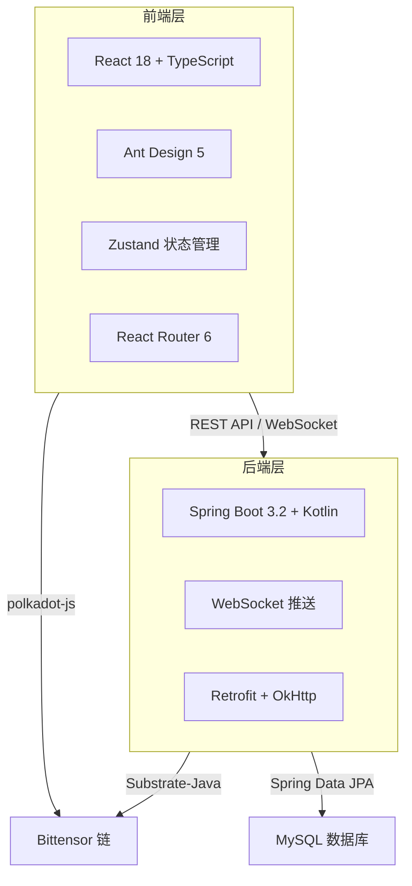
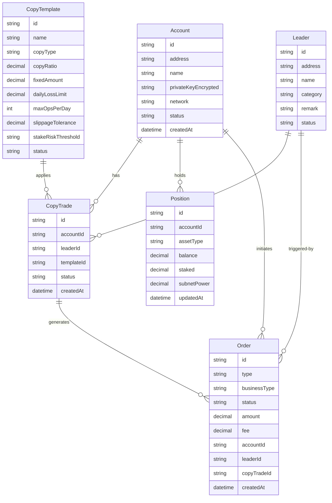

## 1. 架构设计



## 2. 技术说明

- **前端**：React 18 + TypeScript + Vite 5
- **UI 库**：Ant Design 5.12 + @ant-design/icons + @ant-design/charts
- **状态管理**：Zustand
- **路由**：React Router 6
- **HTTP 客户端**：axios（封装请求/响应拦截器）
- **链上交互**：@polkadot/api + @polkadot/extension-dapp
- **多语言**：react-i18next（中/繁/英）
- **图表**：@ant-design/charts (G2Plot) + ECharts
- **WebSocket**：原生 WebSocket 客户端
- **后端**：Spring Boot 3.2.0 + Kotlin 1.9.20 + JPA + MySQL 8.0 + Flyway（后续开发）
- **初始化工具**：Vite 命令行创建

## 3. 路由定义

| 路由 | 页面 | 说明 |
|------|------|------|
| `/login` | 登录页 | 管理员登录 |
| `/` | 仪表盘 | 系统概览统计 |
| `/accounts` | 账户管理 | 多钱包账户管理 |
| `/accounts/:id` | 账户详情 | 单个账户详情 |
| `/leaders` | Leader 管理 | 被跟单地址管理 |
| `/leaders/:id` | Leader 详情 | 单 Leader 详情 |
| `/templates` | 跟单模板 | 风控模板列表 |
| `/templates/new` | 新建模板 | 新建跟单模板 |
| `/templates/:id/edit` | 编辑模板 | 编辑跟单模板 |
| `/copy-trades` | 跟单配置 | 跟单关系管理 |
| `/copy-trades/new` | 新建跟单 | 创建跟单关系 |
| `/orders` | 订单管理 | 订单列表与筛选 |
| `/orders/:id` | 订单详情 | 订单详情 |
| `/positions` | 仓位管理 | 实时持仓可视化 |
| `/statistics` | 统计分析 | 全局统计分析 |
| `/statistics/leader` | Leader 统计 | Leader 维度统计 |
| `/settings/proxy` | 代理配置 | 代理节点管理 |
| `/settings/nodes` | 节点检测 | RPC 节点监控 |
| `/settings/users` | 用户管理 | 后台用户管理 |
| `/settings/announcements` | 公告管理 | 系统公告管理 |

## 4. API 定义

### 4.1 认证
```
POST   /api/auth/login          -> { username, password } -> { token, userInfo }
POST   /api/auth/logout         -> void
GET    /api/auth/userinfo       -> UserInfo
```

### 4.2 仪表盘
```
GET    /api/dashboard/overview  -> { totalAssets, accountCount, activeCopyCount, pnl }
GET    /api/dashboard/recent-orders?limit=10 -> Order[]
GET    /api/dashboard/system-status         -> SystemStatus
```

### 4.3 账户管理
```
GET    /api/accounts                    -> Page<Account>
GET    /api/accounts/:id                -> AccountDetail
POST   /api/accounts/import             -> Account (body: privateKey, name, network)
PUT    /api/accounts/:id                -> Account (body: name, status)
DELETE /api/accounts/:id                -> void
```

### 4.4 Leader 管理
```
GET    /api/leaders                     -> Page<Leader>
GET    /api/leaders/:id                 -> LeaderDetail
POST   /api/leaders                     -> Leader
PUT    /api/leaders/:id                 -> Leader
DELETE /api/leaders/:id                 -> void
```

### 4.5 跟单模板
```
GET    /api/templates                   -> Page<Template>
GET    /api/templates/:id               -> Template
POST   /api/templates                   -> Template
PUT    /api/templates/:id               -> Template
DELETE /api/templates/:id               -> void
```

### 4.6 跟单配置
```
GET    /api/copy-trades                 -> Page<CopyTrade>
GET    /api/copy-trades/:id             -> CopyTrade
POST   /api/copy-trades                 -> CopyTrade
PUT    /api/copy-trades/:id             -> CopyTrade
DELETE /api/copy-trades/:id             -> void
```

### 4.7 订单管理
```
GET    /api/orders                      -> Page<Order> (filters: accountId, leaderId, type, dateRange)
GET    /api/orders/:id                  -> OrderDetail
```

### 4.8 仓位管理
```
GET    /api/positions                   -> Position[]
POST   /api/positions/batch-redeem      -> void
POST   /api/positions/transfer          -> void
```

### 4.9 统计分析
```
GET    /api/statistics/global           -> GlobalStats
GET    /api/statistics/leader/:id       -> LeaderStats
GET    /api/statistics/copy-trade/:id   -> CopyTradeStats
```

### 4.10 WebSocket
```
WS     /ws/positions                    -> PositionUpdate (实时持仓推送)
WS     /ws/orders                       -> OrderUpdate (实时订单推送)
WS     /ws/notifications                -> Notification (系统通知)
```

## 5. 数据模型

### 5.1 ER 图



### 5.2 数据定义语言

```sql
CREATE TABLE account (
    id VARCHAR(36) PRIMARY KEY,
    address VARCHAR(64) NOT NULL UNIQUE,
    name VARCHAR(100),
    private_key_encrypted TEXT NOT NULL,
    network VARCHAR(20) DEFAULT 'bittensor',
    status VARCHAR(20) DEFAULT 'active',
    created_at DATETIME DEFAULT CURRENT_TIMESTAMP,
    updated_at DATETIME DEFAULT CURRENT_TIMESTAMP ON UPDATE CURRENT_TIMESTAMP
);

CREATE TABLE leader (
    id VARCHAR(36) PRIMARY KEY,
    address VARCHAR(64) NOT NULL UNIQUE,
    name VARCHAR(100),
    category VARCHAR(50) COMMENT 'stake/trade',
    remark VARCHAR(500),
    status VARCHAR(20) DEFAULT 'active',
    created_at DATETIME DEFAULT CURRENT_TIMESTAMP
);

CREATE TABLE copy_template (
    id VARCHAR(36) PRIMARY KEY,
    name VARCHAR(100) NOT NULL,
    copy_type VARCHAR(20) NOT NULL COMMENT 'ratio/fixed',
    copy_ratio DECIMAL(10,4),
    fixed_amount DECIMAL(30,10),
    daily_loss_limit DECIMAL(30,10),
    max_ops_per_day INT DEFAULT 10,
    slippage_tolerance DECIMAL(5,4) DEFAULT 0.005,
    stake_risk_threshold VARCHAR(50),
    status VARCHAR(20) DEFAULT 'active',
    created_at DATETIME DEFAULT CURRENT_TIMESTAMP
);

CREATE TABLE copy_trade (
    id VARCHAR(36) PRIMARY KEY,
    account_id VARCHAR(36) NOT NULL,
    leader_id VARCHAR(36) NOT NULL,
    template_id VARCHAR(36) NOT NULL,
    status VARCHAR(20) DEFAULT 'active',
    created_at DATETIME DEFAULT CURRENT_TIMESTAMP,
    FOREIGN KEY (account_id) REFERENCES account(id),
    FOREIGN KEY (leader_id) REFERENCES leader(id),
    FOREIGN KEY (template_id) REFERENCES copy_template(id)
);

CREATE TABLE `order` (
    id VARCHAR(36) PRIMARY KEY,
    type VARCHAR(20) NOT NULL COMMENT 'buy/sell',
    business_type VARCHAR(30) NOT NULL COMMENT 'stake/transfer/swap/redeem',
    status VARCHAR(20) DEFAULT 'pending',
    amount DECIMAL(30,10),
    fee DECIMAL(30,10),
    account_id VARCHAR(36),
    leader_id VARCHAR(36),
    copy_trade_id VARCHAR(36),
    tx_hash VARCHAR(100),
    created_at DATETIME DEFAULT CURRENT_TIMESTAMP,
    FOREIGN KEY (account_id) REFERENCES account(id),
    FOREIGN KEY (leader_id) REFERENCES leader(id)
);

CREATE TABLE position (
    id VARCHAR(36) PRIMARY KEY,
    account_id VARCHAR(36) NOT NULL,
    asset_type VARCHAR(30) NOT NULL COMMENT 'tao_balance/subnet_stake',
    balance DECIMAL(30,10) DEFAULT 0,
    staked DECIMAL(30,10) DEFAULT 0,
    subnet_power DECIMAL(30,10) DEFAULT 0,
    updated_at DATETIME DEFAULT CURRENT_TIMESTAMP ON UPDATE CURRENT_TIMESTAMP,
    FOREIGN KEY (account_id) REFERENCES account(id)
);
```
